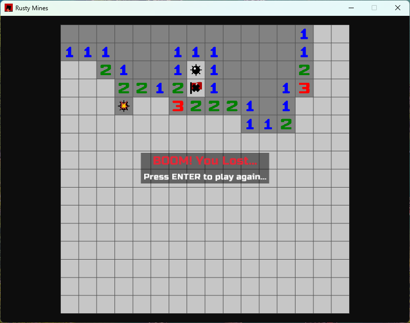

## Rusty Mines
A clone of the classic minesweeper game, build as a "let's try Rust" excercise. 
The game works and all main featues of minesweeper are implemented (flag, reveal, flood-fill, "chord"), but needs clean-up and refactoring.

## To build for the web:
rustup target add wasm32-unknown-unknown

### Debug build
cargo build --target wasm32-unknown-unknown

This will produce .wasm file in target/debug/wasm32-unknown-unknown/CRATENAME.wasm

### Release build
cargo build --target wasm32-unknown-unknown --release

target/release/wasm32-unknown-unknown/CRATENAME.wasm

### To test web build locally
Install a local http server. Example:
cargo install basic-http-server

From the directory with the index.html and your.wasm file run:
basic-http-server .
